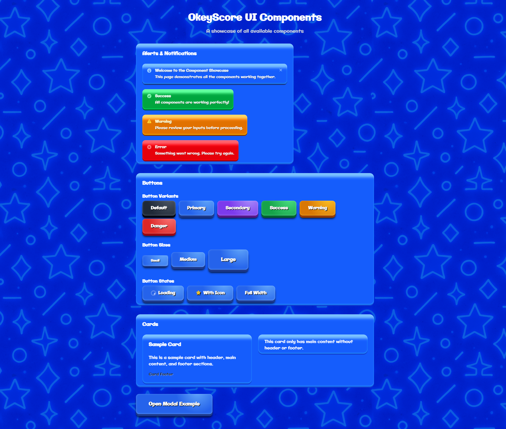

# OkeyScore UI Starter Kit



A React-based UI component library starter kit designed for game interface development. This project provides a foundation for building consistent, accessible game user interfaces with a modern design system.

## Overview

This is a **starter kit** - a basic foundation for game UI development. It's intentionally simple and not feature-complete, serving as a starting point for developers who want to build game interfaces with React and TypeScript.

## Features

- **Design System**: Consistent component styling with blue-based color scheme
- **Core Components**: Button, Card, Modal, Alert with multiple variants
- **TypeScript**: Full type safety and IntelliSense support
- **Storybook**: Interactive component documentation and testing
- **Tailwind CSS**: Utility-first styling approach
- **Accessibility**: ARIA labels, keyboard navigation, and semantic HTML

## Components

- **Button**: Multiple variants (default, primary, secondary, success, warning, danger) and sizes (small, medium, large)
- **Card**: Container component with header, main, and footer sections
- **Modal**: Overlay dialogs with backdrop and keyboard support
- **Alert**: Notification components with dismissible functionality

## Getting Started

1. **Install dependencies**:
   ```bash
   npm install
   ```

2. **Start the development server**:
   ```bash
   npm run dev
   ```

3. **View Storybook documentation**:
   ```bash
   npm run storybook
   ```

## Development Status

This is a **starter kit** and should be considered:
- ✅ Functional foundation
- ✅ Basic component set
- ⚠️ Not production-ready
- ⚠️ Limited feature set
- ⚠️ Requires customization for specific use cases

## Contributing

We welcome contributions from the community! This project is designed to be a collaborative foundation for game UI development.

### How to Contribute

1. **Fork the repository**
2. **Create a feature branch**: `git checkout -b feature/your-feature-name`
3. **Make your changes** following the existing code style
4. **Add tests** if applicable
5. **Submit a pull request** with a clear description of your changes

### Contribution Guidelines

- **Keep it simple**: This is a starter kit, not a full-featured library
- **Follow existing patterns**: Maintain consistency with current component structure
- **Document your changes**: Update Storybook stories for new components
- **Test thoroughly**: Ensure components work across different scenarios
- **Be professional**: Write clear, maintainable code with proper comments

### What We're Looking For

- New UI components relevant to game interfaces
- Improvements to existing components
- Better accessibility features
- Performance optimizations
- Documentation improvements
- Bug fixes and edge case handling

## Project Structure

```
src/
├── components/          # UI components
│   ├── Button/         # Button component
│   ├── Card/           # Card component
│   ├── Modal/          # Modal component
│   └── Alert/          # Alert component
├── stories/            # Storybook stories
└── assets/             # Images and static files
```

## Technology Stack

- **React 18** - UI framework
- **TypeScript** - Type safety
- **Tailwind CSS** - Styling
- **Storybook** - Component documentation
- **Vite** - Build tool

## License

This project is open source and available under the [MIT License](LICENSE).

## Support

This is a community-driven starter kit. For questions or support:
- Open an issue for bugs or feature requests
- Check existing issues for similar problems
- Contribute improvements through pull requests

---

**Note**: This starter kit is intentionally basic to serve as a foundation. Feel free to extend it based on your specific game UI needs!
